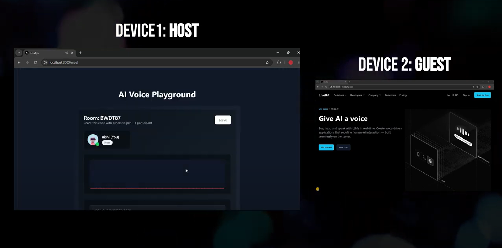

# AI Voice Streaming with LiveKit

A real-time voice streaming application that combines AI-powered text-to-speech with LiveKit's real-time communication infrastructure. Create rooms, generate AI speech, and stream it to multiple participants in real-time.

<div align="center">
  
  <p><em>Landing Page Hero Section - LiveKit</em></p>
</div>

## Features

- 🎙️ Real-time voice streaming using LiveKit
- 🤖 AI-powered text-to-speech synthesis
- 🔊 Live audio visualization
- 🏠 Room-based communication
- 👥 Multi-participant support
- 🎨 Modern UI with Tailwind CSS and Shadcn/ui

### Video Demo
[](https://www.youtube.com/watch?v=xQkawNU9kQs)

<div align="center">
  
  <p><em>Realtime communication between two users</em></p>
</div>

## Tech Stack

- **Frontend Framework**: Next.js 14 with App Router
- **Real-time Communication**: LiveKit
- **Styling**: Tailwind CSS
- **UI Components**: Shadcn/ui
- **Audio Processing**: Web Audio API
- **Text-to-Speech**: Web Speech API
- **State Management**: React Hooks
- **Animations**: Framer Motion

## How It Works

<div align="center">
  
  <p><em>Meeting Entry - Create room or Join room</em></p>
</div>

1. **LiveKit Integration**:
   - Uses LiveKit for real-time audio streaming between participants
   - Handles room creation, joining, and participant management
   - Manages audio track publishing and subscription

<div align="center">
  
  <p><em>Audio visualization - Guest and Host</em></p>
</div>

2. **Audio Pipeline**:
   - Converts text to speech using Web Speech API
   - Processes audio using Web Audio API
   - Visualizes audio waveforms in real-time
   - Streams processed audio to all participants

<div align="center">
  
  <p><em>Meeting Room - Host joined</em></p>
</div>

3. **Room Management**:
   - Create new rooms or join existing ones
   - Automatic host/guest role assignment
   - Real-time participant tracking

<div align="center">
  
  <p><em>Audio visualization - AI Host audio</em></p>
</div>

## Getting Started

1. **Prerequisites**:
   ```bash
   Node.js 18+ and npm
   LiveKit server (or LiveKit Cloud account)
   ```

2. **Environment Setup**:
   ```bash
   # Clone the repository
   git clone https://github.com/nishi-panchal/ai-voice-streaming.git
   cd ai-voice-streaming

   # Install dependencies
   npm install

   # Create .env.local file
   cp .env.example .env.local
   ```

3. **Configure Environment Variables**:
   ```env
   NEXT_PUBLIC_LIVEKIT_URL=your_livekit_url
   LIVEKIT_API_KEY=your_api_key
   LIVEKIT_API_SECRET=your_api_secret
   ```

4. **Run the Development Server**:
   ```bash
   npm run dev
   ```

5. **Build for Production**:
   ```bash
   npm run build
   npm start
   ```

## Usage

1. Visit the application URL
2. Enter your name and optionally a room code
3. Create a new room or join an existing one
4. As host:
   - Type text in the input field
   - Click "Generate Voice" to synthesize and stream audio

<div align="center">
  
  <p><em>AI prompt message to generate voice</em></p>
</div>

5. As guest:
   - Join using a room code
   - Listen to the streamed audio
   - See real-time audio visualization (WIP)

## LiveKit Implementation Details

The application uses LiveKit for real-time communication:

- **Room Creation**: Uses LiveKit's server API to generate tokens and create rooms
- **Audio Streaming**: Publishes synthesized speech as audio tracks
- **Track Subscription**: Automatically subscribes guests to host's audio
- **Connection Management**: Handles reconnection and disconnection
- **Participant Tracking**: Real-time updates of room participants

<div align="center">
  
  <p><em>Console log - guest side- track subscribed to host audio</em></p>
</div>

## Contributing

1. Fork the repository
2. Create your feature branch (`git checkout -b feature/amazing-feature`)
3. Commit your changes (`git commit -m 'Add some amazing feature'`)
4. Push to the branch (`git push origin feature/amazing-feature`)
5. Open a Pull Request


## Acknowledgments

- [LiveKit](https://livekit.io/) for real-time communication infrastructure
- [Shadcn/ui](https://ui.shadcn.com/) for UI components
- [Tailwind CSS](https://tailwindcss.com/) for styling
- [Next.js](https://nextjs.org/) for the framework
